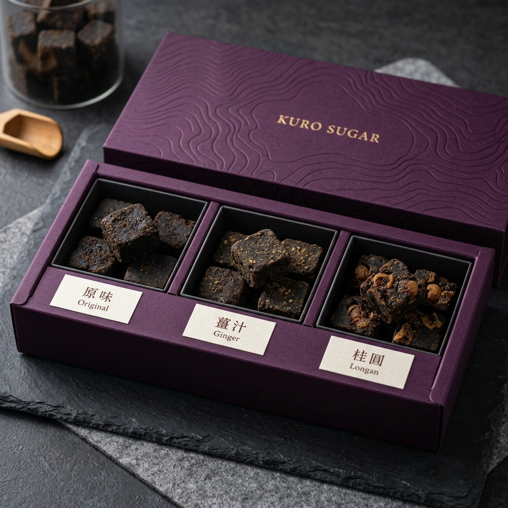

# 鐵比倫產品研發提案：【三境系列】埔里三境 ‧ 風土黑糖集

> **「原味的地心之甘、薑汁的谷之暖、桂圓的木之韻，織就一份來自土地的溫暖安慰。」**

此提案針對原味、薑汁、桂圓紅棗三款口味進行組合開發，旨在將「產品」升級為「風土體驗」。透過不同口味的感官層次，對應埔里的三種自然原力。

---

## 1. 口味研發與命名對位 (Flavors & Narrative)

### 第一境：原味 ‧ 「地心之甘」 (Deep Soil)
*   **敘事**：萬年湖底沉積土孕育的紅甘蔗原力，無任何添加，純粹展現時間的厚度。
*   **心理目標**：提供最基礎、最純淨的**安全感**。

### 第二境：薑汁 ‧ 「谷之暖」 (Mountain Warmth)
*   **敘事**：埔里山谷栽種的小黃薑，帶著山靈的辛香。與黑糖交織出如冬日陽光般的暖意。
*   **心理目標**：為身體提供**直接的能量**與**被照顧感**。

### 第三境：桂圓紅棗 ‧ 「木之韻」 (Wood Echo)
*   **敘事**：中寮龍眼木三日夜柴燒桂圓，帶著微辛的煙香與紅棗的潤。這是一場關於「木與火」的古老對話。
*   **心理目標**：提供深度放鬆的**質感享受**與**靜謐儀式**。

---

## 2. 視覺策略：內斂的奢華 (Visual Strategy)

*   **色彩編碼**：
    *   主盒：**深黑紫 (#3D003D)** 展現品牌的神秘與權威。
    *   內襯：使用 **焦糖深棕 (#4B2C1A)** 紙材區分口味。
*   **包裝設計**：
    *   三格獨立分裝，保留每款黑糖塊自帶的香氣（原味、薑香、煙燻桂圓香）。
    *   封條標籤採用優雅的宋體（明體），強調「職人監製、敘實精鍊」。

---

## 3. 伴手禮溢價點 (Premium Hooks)

*   **非大量製造的質感**：強調每一顆都是「21 年研製經驗下的火候結晶」。
*   **地層等高線元素**：在盒蓋內側印製埔里地層分佈圖，增加開箱時的「探索感」。
*   **情感訴求**：這不只是糖，是家人的溫暖，是職人的守護。
