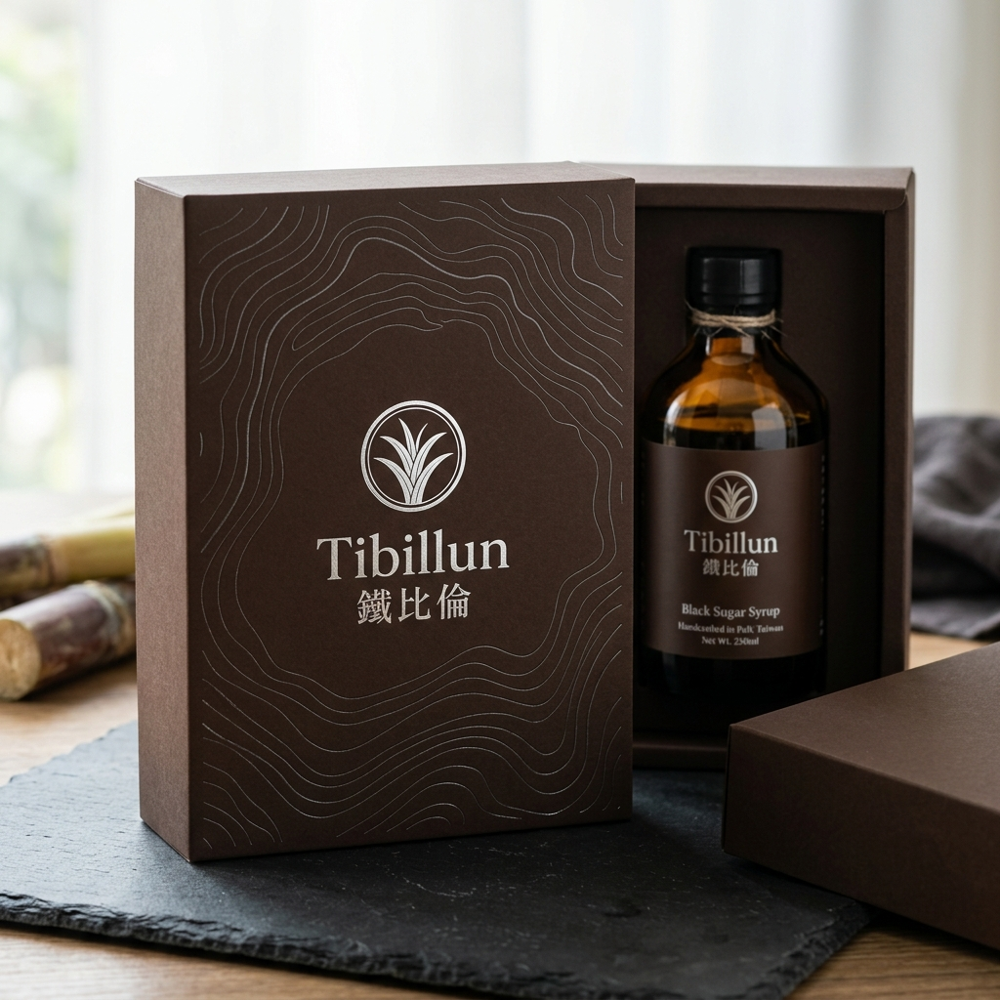

# 鐵比倫產品研發提案：【古湖系列】萬年湖底 ‧ 沉靜黑糖蜜

> **「將萬年地層的溫厚，熬煉成一抹在舌尖化開的安靜。」**

此提案為「鐵比倫產品研發專用技能 (tiebilum-product-dev)」建立後的首款先導產品，旨在將埔里深厚的地質資源轉化為具備高度文化溢價的精品伴手禮。

---

## 1. 研發邏輯對位 (Strategic Alignment)

### 風土溯源 (Terroir Moat)
*   **地質背景**：古埔里湖底深層沉積土，富含微量元素。
*   **水質來源**：海拔 1300 公尺鐵比倫溪純淨山泉。
*   **工藝支撐**：21 年副產加工經驗，對糖蜜濃縮度的極致講究。

### 心理對位 (Persona Goal)
*   **目標客群**：**生活品味家 (The Urban Escapist)**。
*   **解決痛點**：現代生活的數位高壓與虛浮感。
*   **終極回報**：透過一份「有土地重量」的禮物，獲得片刻的靜謐儀式感。

---

## 2. 產品規格與內容 (Specs & Copy)

*   **品名**：**萬年湖底 ‧ 沉靜黑糖蜜 (The Ancient Lake Series)**
*   **核心文案**：
    > 埔里盆地的溫潤微氣候，與萬年前湖泊沉積的沃土，
    > 在鐵比倫的熬煮中化為時間的產物。
    > 它不是速成的甜，而是地層深處傳遞出的溫厚。
*   **建議用途**：淋在希臘優格、淋在手工麵包、或是在深夜加入一杯溫熱的威士忌。

---

## 3. 包裝視覺策略 (Visual Strategy)

*   **色彩應用**：
    *   主色：**焦糖琥珀 / 深棕 (#4B2C1A)** 霧面質感包裝盒。
    *   輔色：**溪石灰 (#A9A9A9)** 燙印埔里盆地等高線。
*   **設計語法**：內斂且講究。捨棄過多的產品圖片，讓「地理等高線」訴說土地的故事。
*   **Logo 位置**：品牌標誌置於視覺重心，強化「工藝守護者」的權威感。

---

## 4. 產品研發技能狀態
*   **技能名稱**：`tiebilum-product-dev`
*   **已收錄資產**：Logo 系列、品牌色碼、地質研究、Persona 矩陣。
*   **未來應用**：當您需要發想新口味（如：柴燒桂圓薑汁）時，只需召喚此技能，即可產出同等級的提案。
